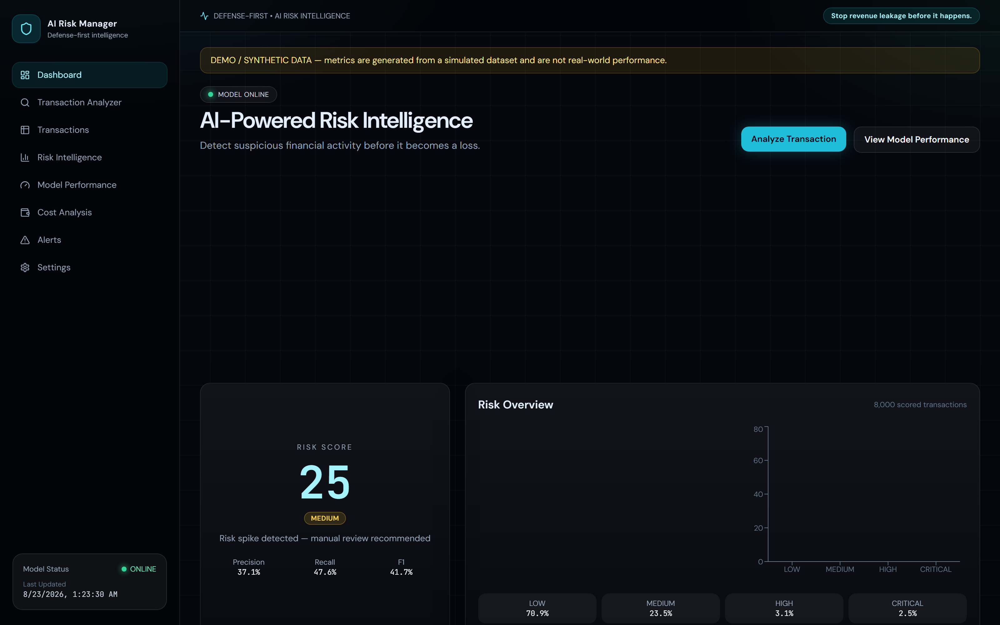
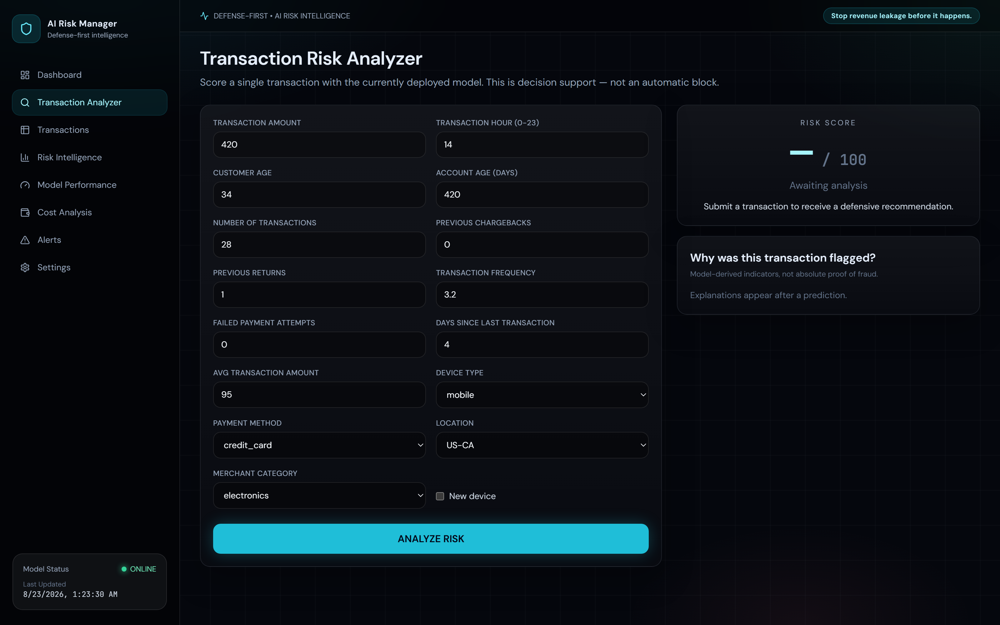
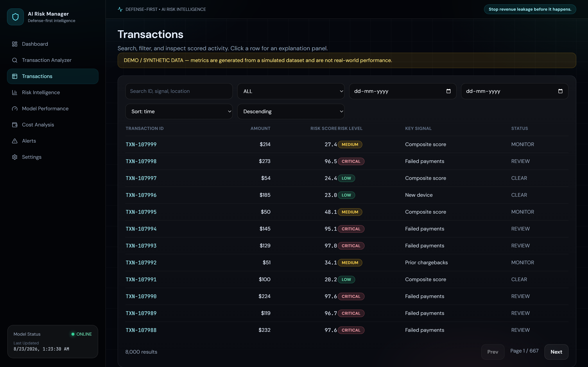
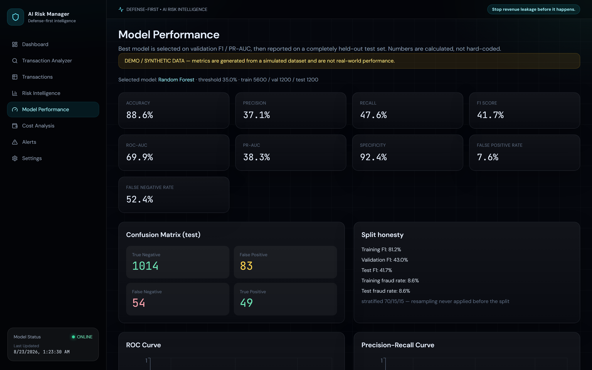
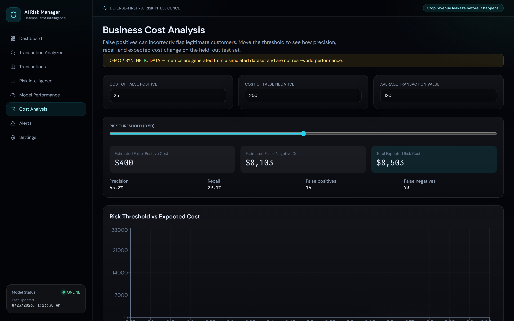
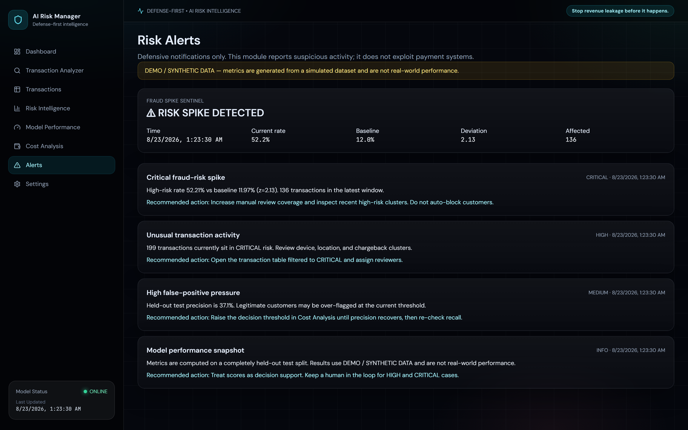
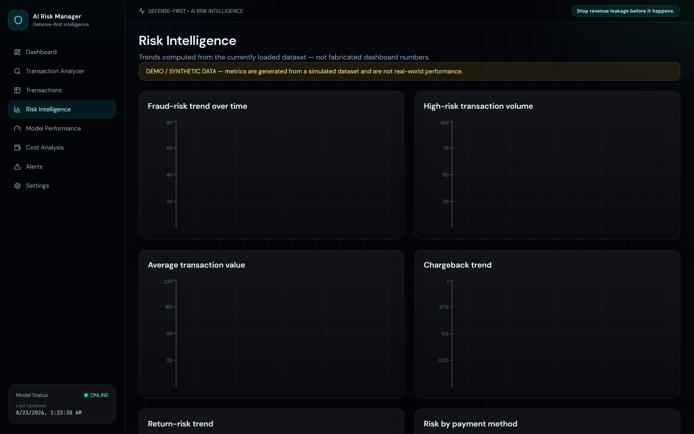

<div align="center">

# AI Risk Manager

**Stop revenue leakage before it happens.**

Defense-first AI risk intelligence for merchants — detect fraud risk, explain the score, and report honest model metrics.

`DEFENSE-FIRST` · `AI RISK INTELLIGENCE` · `DEFENSIVE ML ONLY`

[](#tech-stack)
[](#tech-stack)
[](#tech-stack)
[](#tech-stack)

<br/>



<sub>Live dashboard on the demo dataset. Metrics are calculated on a held-out test set — not hard-coded.</sub>

</div>

<br/>

> **This project is designed exclusively for defensive risk detection and financial-loss prevention.**  
> It does not help anyone commit fraud, bypass fraud controls, evade security systems, or exploit payment rails.

---

## Product tour

<div align="center">

<p><b>Transaction Risk Analyzer</b> — score a payment, get 0–100 risk, LOW / MEDIUM / HIGH / CRITICAL, and model-derived explanations.</p>
</div>

<p align="center">
  
  
</p>
<p align="center">
  <sub><b>Transactions</b> with search, filters, and risk badges &nbsp;·&nbsp; <b>Model Performance</b> with honest test metrics, confusion matrix, ROC & PR</sub>
</p>

<p align="center">
  
  
</p>
<p align="center">
  <sub><b>Cost Analysis</b> — false-positive vs false-negative tradeoff &nbsp;·&nbsp; <b>Alerts</b> — Fraud Spike Sentinel and recommended review actions</sub>
</p>

<div align="center">

<p><b>Risk Intelligence</b> — trends over time, by payment method, device, and region, from the loaded dataset.</p>
</div>

---

## Why it exists

Fraud, returns, and chargebacks leak revenue after a sale looks successful. Merchants need a working system that can:

1. Score incoming transactions
2. Rank them as **LOW / MEDIUM / HIGH / CRITICAL**
3. Explain *why* the model raised the score
4. Show **precision, recall, F1, ROC-AUC, and false-positive cost** — not a vanity accuracy number
5. Warn when risk volume spikes

False positives matter. Flagging a legitimate customer is a real business cost. This product treats that tradeoff as a first-class control.

---

## Tech stack

| Layer | Stack |
| --- | --- |
| Frontend | React, TypeScript, Vite, Tailwind CSS, Recharts, Framer Motion, Lucide |
| Backend | Python, FastAPI, Pydantic |
| ML | scikit-learn, XGBoost, pandas, NumPy, joblib |

```
React (Vite + TypeScript)  ── /api proxy ──►  FastAPI
                                              ├─ DEMO / SYNTHETIC data (labeled)
                                              ├─ sklearn / XGBoost pipelines
                                              ├─ stratified 70 / 15 / 15 split
                                              └─ scoring, alerts, cost curves
```

On startup the API trains **Logistic Regression**, **Random Forest**, and **XGBoost**, selects the best model on **validation**, then freezes evaluation on a **held-out test set**.

---

## Quick start

**Backend**

```bash
cd backend
python -m pip install -r requirements.txt
python -m uvicorn main:app --reload --host 127.0.0.1 --port 8000
```

First boot trains the demo models (about 15–40 seconds).

**Frontend**

```bash
cd frontend
npm install
npm run dev
```

Open [http://localhost:5173](http://localhost:5173). If that port is busy, Vite uses the next one (for example 5174) and still proxies `/api` to port 8000.

Try an upload from **Settings** with `backend/data/sample_transactions.csv`.

Interactive API docs: [http://127.0.0.1:8000/docs](http://127.0.0.1:8000/docs)

---

## What you can do

| Step | Screen |
| --- | --- |
| Open the dashboard (demo model already trained) | Dashboard |
| Upload a CSV or keep labeled demo data | Settings |
| Read **test** precision / recall / F1 / ROC-AUC | Model Performance |
| Analyze one transaction and see the explanation | Transaction Analyzer |
| Search, filter, and inspect scored activity | Transactions |
| Inspect trends by time, rail, device, region | Risk Intelligence |
| Watch Fraud Spike Sentinel | Alerts |
| Tune false-positive vs false-negative cost | Cost Analysis |

Scores are **decision support**. The app does not automatically block payments.

---

## Dataset

If you do not upload a file, the app generates an **8,000-row** synthetic transaction table over 90 days, with an injected recent risk burst so the spike sentinel has a signal.

**All synthetic results are marked DEMO / SYNTHETIC DATA. They are not real-world performance.**

Required columns (aliases accepted):

`amount`, `hour`, `customer_age`, `account_age_days`, `num_transactions`, `previous_chargebacks`, `previous_returns`, `device_type`, `payment_method`, `location`, `transaction_frequency`, `failed_payment_attempts`, `is_new_device`, `days_since_last_transaction`, `avg_transaction_amount`, `merchant_category`, `is_fraud`

Optional: `timestamp`, `transaction_id`.

No payment credentials or unnecessary personal data are collected. Uploads are capped at **10 MB**, `.csv` / `.xlsx` only.

---

## ML methodology

1. Load and validate columns
2. Clean types / missing values
3. **Stratified split first** — 70% train, 15% validation, 15% test
4. Fit class-weighted models on train only
5. Tune the operating threshold on validation
6. Evaluate once on the held-out test set
7. Serve `/api/predict` from the winner

Random seed: `42`. Preprocessing lives **inside** the sklearn `Pipeline` (median/mode impute, scale numerics, one-hot categoricals with `handle_unknown="ignore"`).

### Imbalanced data

Fraud labels are rare. This project uses class weights, XGBoost `scale_pos_weight`, stratified splits, and threshold tuning.

**SMOTE / oversampling is never applied before the train/test split.** Doing that leaks test information and inflates metrics.

### Model selection

Candidates: Logistic Regression, Random Forest, XGBoost.

Validation score:

`0.40 × precision + 0.30 × F1 + 0.20 × PR-AUC + 0.10 × recall`

The UI still shows **train / validation / test** for every candidate. If the model is weak, the dashboard shows the weak numbers.

Priority is **not** accuracy: precision → recall → F1 → ROC-AUC → PR-AUC → false-positive cost → false-negative cost.

Explanations use coefficients (linear) or importance-weighted deviations from the training background (trees). They are **model-derived indicators, not proof of fraud.**

---

## Evaluation

| Split | Role |
| --- | --- |
| Train | Fit only |
| Validation | Threshold + model selection |
| Test | Final metrics, ROC, PR, confusion matrix, cost curve |

Reported test metrics: accuracy, precision, recall, F1, ROC-AUC, PR-AUC, specificity, FPR, FNR, confusion matrix (TN / FP / FN / TP).

### False-positive cost

On **Cost Analysis** you set the cost of a false positive, the cost of a false negative, and average transaction value. The backend sweeps thresholds on held-out probabilities so you can watch precision, recall, and expected cost move together.

---

## API

| Method | Path | Purpose |
| --- | --- | --- |
| GET | `/api/health` | Liveness + model status |
| GET | `/api/overview` | KPIs, distribution, spike |
| POST | `/api/predict` | Score one transaction |
| POST | `/api/analyze` | Same as predict |
| GET | `/api/transactions` | Search / filter / paginate |
| GET | `/api/metrics` | KPI + test snapshot |
| GET | `/api/model-performance` | Full comparison + curves |
| GET | `/api/risk-distribution` | LOW–CRITICAL mix |
| GET | `/api/alerts` | Alert center + spike |
| GET | `/api/trends` | Time and segment charts |
| GET | `/api/cost-analysis` | Threshold vs cost |
| POST | `/api/train` | Retrain (optional `use_demo`) |
| POST | `/api/upload` | CSV/XLSX upload + retrain |

---

## Security (MVP)

- Pydantic validation on predict payloads
- File type + 10 MB size limits
- Safe `pandas.read_csv` / `read_excel` only
- No shell execution from user input
- No credential collection

---

## Limitations & ethics

- Demo labels are simulated. Do not cite them as production fraud-catch rates.
- Feature explanations are attributions, not investigations.
- The app recommends review; it does **not** auto-block payments.
- This MVP keeps data in memory. There is no multi-user auth layer.

Use this software to **reduce loss and protect legitimate customers**, not to over-block or hide behind a score. Keep a human in the loop for HIGH and CRITICAL cases. Do not feed raw card numbers, CVVs, or government IDs into the model.

---

## Future improvements

- Persistent model registry and audit log
- Per-merchant calibration and champion/challenger
- Optional SHAP plots when the dependency is approved
- Role-based access and signed uploads
- Streaming scores from a payment gateway (read-only, defensive)

---

<div align="center">

**AI Risk Manager** · defense-first · stop revenue leakage before it happens.

</div>
# AI_Risk_manager

## Documentation Status
Last documentation review: 19 September 2026
